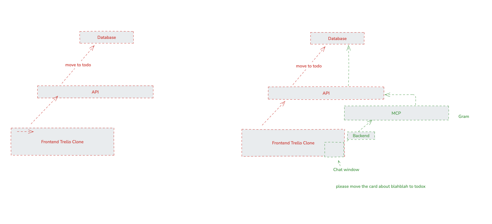

# Guidance on writing technical guides

If you're writing a **guide**, this means that you're showing the reader how to solve a problem, by example.

The following patterns are not hard rules that need to appear in all guides, but they are good defaults to have in many guides and they should only be violated when there is a good reason to do so.

## The start of a guide 

* **Summarize what the guide will achieve and who the target reader is:** The guide should start with a clear summary of what it does. Generally that means something like "In this guide, we'll show you how to build x with y", and not other extraneous context like "A recent survey showed that...". If a reader found the page, they likely already have high-level context, so get to the meat as quickly as possible. Also explain who the target reader is. We should still [avoid guessing what a reader wants](Style.md#avoid-guessing-out-loud-what-the-reader-wants), but you should help the reader identify very efficiently a) who the guide is for, b) what the reader needs to complete it, and c) what the reader will get from following it.

* **Explain the benefits and outcome of the guide** Where relevant, explain to the reader the benefit of following the guide as part of the introduction. You don't need to sell it or hype it, but often a good demo of the end result (e.g. an animated gif or short video) saying "By following this guide, you'll build... that looks like..." helps the reader decide if it's worth the effort to follow along.

* **Include a diagram showing how components fit together**. Often a guide explains how to create or connect several components. While it might be obvious how they fit together and where data flows to the writer, the reader probably has less context. Where useful, include a diagram showing what the reader is starting with and what they will add by following the guide.

* **Follow the `main` and `completed-app` repo pattern**. A common pattern for guides is to assume that the reader already has something. You can provide an example of this in the accompanying repository, in the `main` branch. Assume that the reader has a goal state. You can include this in a `completed-app` branch of the same example repository. The guide should then cleanly show how to get from the starting point to the goal state, giving the reader the option of cloning the repo and stepping through the guide, or skipping to the end and taking just the result as a starting point.

## Not just how but also why  

If you're explaining how to join various components together, keep the reader updated with context about the *why* and not just the *how*. While a majority of the guide is likely to be focused on step-by-step instructions and explaining *how* to do something, you should also have regular check-in points with the reader to explain some 'why' context. For simple guides without any options, this is not always needed, but for complicated guides the reader is likely to be skeptical of some of the author's decisions, and it's important to pre-empt these objections and explain why decisions were made.

For example, "Slack doesn't provide an official MCP server, so we will need to build our own custom one. We'll use FastAPI and FastMCP for this. There are open source options available but they are very heavy, complicated, and have [reported vulnerabilities](#)." is better than "Now create a new FastAPI project by running the following commands".

Think of the reader as interested and intelligent but slightly skeptical. They have the option to close the tab at any time. You don't need to justify every decision you make, but if you think the reader is likely to question or disagree with a specific decision made, then you should explain the reasoning behind that decision.

## Code examples

Generally, when asking the reader to add code you should, you should follow a three-step pattern.

1. Be very specific about *where* to add the code. Normally this means stating the exact file by name and the line number, and anything else that the reader needs t odo
2. Show the code
3. Provide any extra context

Avoid [switching between instruction and exlanation](Style.md#dont-switch-from-explanation-to-instruction-in-a-way-that-the-reader-might-overlook).

